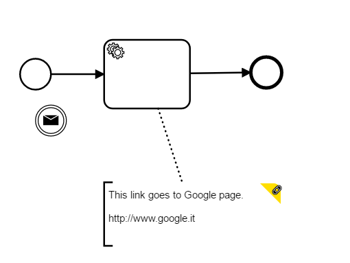

# Camunda Modeler - bpmn-js Link on comments Plugin

This plugin adds one simple functionality to comments in Camunda Modeler. With this you can add uris in your comment (a bpmn:TextAnnotation element) and open them in your system default application, just add your text and then start a new paragraph with your link, and that's all!

## How to install
Put the directory into the `plugins` directory of the modeler.
